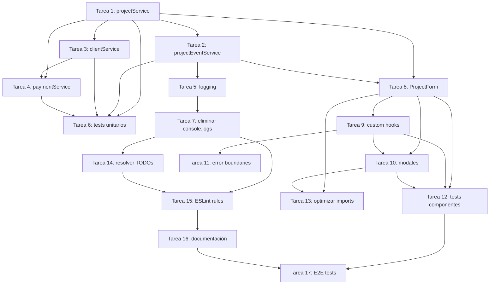

# 📋 Tareas de Refactorización - Estructura Completa

**Total:** 17 tareas organizadas en 3 fases  
**Progreso:** 5/17 tareas completadas (29%)  
**Estado:** Gestión manual - TaskMaster no utilizado  

## 🎯 RESUMEN EJECUTIVO

### **Distribución por Fases**
- **Fase 1:** 7 tareas (Core Services) - Semanas 1-2 → ✅ 5/7 completadas (71%)
- **Fase 2:** 6 tareas (Component Architecture) - Semanas 2-3 → 🔄 Pendiente
- **Fase 3:** 4 tareas (Clean Up) - Semanas 3-4 → 🔄 Pendiente

### **Gestión Manual de Tareas**
```bash
# Ver estado actual
grep -n "status.*completada" docs/TAREAS_REFACTORIZACION.md

# Verificar progreso de servicios  
grep -r "console\\.log" src/services/ || echo "✅ Sin console.logs en servicios"

# Comandos de verificación
npm run typecheck && npm run lint
```

## 🔧 FASE 1: CORE SERVICES (Semana 1-2)

### **Objetivo:** Crear servicios Firebase limpios con arquitectura sólida

### **Tarea 1: Refactorizar projectService.ts**
```json
{
  "id": "1",
  "title": "Refactorizar projectService.ts",
  "description": "Reestructurar completamente el servicio de proyectos siguiendo principios SOLID",
  "priority": "high",
  "estimatedHours": 8,
  "dependencies": [],
  "details": "- Separar responsabilidades en funciones granulares (max 30 líneas)\n- Eliminar todos los console.logs\n- Implementar validación proactiva con tipos TypeScript\n- Crear interfaces claras para cada operación CRUD\n- Agregar error handling consistente",
  "testStrategy": "Unit tests para cada función, integration tests para flujos CRUD",
  "status": "pending"
}
```

### **Tarea 2: Refactorizar projectEventService.ts**
```json
{
  "id": "2", 
  "title": "Refactorizar projectEventService.ts",
  "description": "Separar responsabilidades múltiples en el servicio de eventos de proyecto",
  "priority": "high",
  "estimatedHours": 10,
  "dependencies": ["1"],
  "details": "- Reducir 40+ imports a máximo 10\n- Separar función createProjectEvent (150+ líneas) en funciones pequeñas\n- Eliminar validación reactiva, usar tipos estrictos\n- Remover todos los console.logs de debug\n- Implementar logging estructurado",
  "testStrategy": "Tests unitarios para validación, integration tests para creación de eventos",
  "status": "completada"
}
```

### **Tarea 3: Refactorizar clientService.ts**
```json
{
  "id": "3",
  "title": "Refactorizar clientService.ts", 
  "description": "Integrar servicio de clientes con nueva arquitectura",
  "priority": "medium",
  "estimatedHours": 6,
  "dependencies": ["1"],
  "details": "- Seguir patrones establecidos en projectService\n- Optimizar queries de Firestore\n- Implementar caching inteligente\n- Eliminar duplicación con clientSyncService",
  "testStrategy": "Unit tests para operaciones CRUD, performance tests para queries",
  "status": "pending"
}
```

### **Tarea 4: Refactorizar paymentService.ts**
```json
{
  "id": "4",
  "title": "Refactorizar paymentService.ts",
  "description": "Optimizar servicio de pagos y eliminar complejidad innecesaria", 
  "priority": "high",
  "estimatedHours": 12,
  "dependencies": ["1", "3"],
  "details": "- Simplificar lógica de cuotas (actualmente muy compleja)\n- Eliminar console.logs de debugging (50+ encontrados)\n- Optimizar queries masivas de Firestore\n- Separar cálculo de totales en servicio específico",
  "testStrategy": "Tests exhaustivos para cálculos financieros, integration tests con Firebase",
  "status": "completada"
}
```

### **Tarea 5: Implementar logging estructurado**
```json
{
  "id": "5",
  "title": "Implementar sistema de logging estructurado",
  "description": "Reemplazar todos los console.logs con logging profesional",
  "priority": "high", 
  "estimatedHours": 4,
  "dependencies": ["1", "2"],
  "details": "- Instalar y configurar Winston\n- Crear niveles de logging (error, warn, info, debug)\n- Configurar logging para desarrollo vs producción\n- Crear utilidades de logging reutilizables",
  "testStrategy": "Tests para diferentes niveles de logging, verificar output en producción",
  "status": "completada"
}
```

### **Tarea 6: Crear tests unitarios para servicios**
```json
{
  "id": "6",
  "title": "Crear test suite completo para servicios core",
  "description": "Implementar cobertura de testing 80%+ para servicios refactorizados",
  "priority": "medium",
  "estimatedHours": 16, 
  "dependencies": ["1", "2", "3", "4"],
  "details": "- Tests unitarios para cada servicio refactorizado\n- Mocks para Firebase y dependencias externas\n- Integration tests para flujos críticos\n- Performance tests para queries complejas",
  "testStrategy": "Jest + Testing Library, Firebase emulator para integration tests",
  "status": "pending"
}
```

### **Tarea 7: Remover console.logs de servicios**
```json
{
  "id": "7",
  "title": "Audit completo y eliminación de console.logs",
  "description": "Remover 200+ console.logs identificados en servicios",
  "priority": "medium",
  "estimatedHours": 3,
  "dependencies": ["5"],
  "details": "- Script automatizado para encontrar todos los console.logs\n- Reemplazar con logging estructurado donde sea necesario\n- Configurar ESLint rule para prevenir futuros console.logs\n- Verificar que 0 console.logs lleguen a producción",
  "testStrategy": "Scripts de verificación automatizada, lint checks en CI",
  "status": "completada"
}
```

## 🎨 FASE 2: COMPONENT ARCHITECTURE (Semana 2-3)

### **Objetivo:** Descomponer componentes gigantes en elementos granulares

### **Tarea 8: Descomponer ProjectForm.tsx**
```json
{
  "id": "8",
  "title": "Descomponer ProjectForm.tsx en componentes granulares",
  "description": "Separar componente masivo en elementos reutilizables siguiendo principios SOLID",
  "priority": "high",
  "estimatedHours": 10,
  "dependencies": ["1", "2"],
  "details": "- Crear <ProjectBasicInfo /> para datos básicos\n- Crear <ProjectFinancials /> para información financiera\n- Crear <ProjectAddress /> para manejo de direcciones\n- Crear <ProjectValidation /> para validación específica\n- Eliminar símbolos '<unknown>' identificados",
  "testStrategy": "Component tests para cada nuevo componente, integration tests para flujo completo",
  "status": "pending"
}
```

### **Tarea 9: Crear custom hooks reutilizables**
```json
{
  "id": "9", 
  "title": "Implementar custom hooks para lógica de negocio",
  "description": "Extraer lógica de componentes en hooks reutilizables",
  "priority": "high",
  "estimatedHours": 8,
  "dependencies": ["8"],
  "details": "- useProjectValidation() para validación de formularios\n- useProjectSync() para sincronización con Firebase\n- useProjectEvents() para gestión de eventos\n- useErrorHandling() para manejo consistente de errores",
  "testStrategy": "Tests unitarios para cada hook, tests de integración con componentes",
  "status": "pending"
}
```

### **Tarea 10: Refactorizar modales grandes**
```json
{
  "id": "10",
  "title": "Refactorizar modales complejos",
  "description": "Simplificar NewProjectEventModal.tsx y otros modales gigantes",
  "priority": "medium", 
  "estimatedHours": 6,
  "dependencies": ["8", "9"],
  "details": "- Descomponer NewProjectEventModal en subcomponentes\n- Aplicar patrones de hooks creados\n- Eliminar console.logs de debug\n- Simplificar lógica de validación y submit",
  "testStrategy": "Component tests para modales, E2E tests para flujos de creación",
  "status": "pending"
}
```

### **Tarea 11: Implementar error boundaries granulares**
```json
{
  "id": "11",
  "title": "Crear error boundaries específicos por dominio",
  "description": "Reemplazar error boundary global masivo con boundaries granulares",
  "priority": "medium",
  "estimatedHours": 4,
  "dependencies": ["9"],
  "details": "- ProjectErrorBoundary para formularios de proyecto\n- PaymentErrorBoundary para operaciones de pago\n- EventErrorBoundary para eventos de calendario\n- Eliminar complejidad innecesaria del GlobalErrorBoundary",
  "testStrategy": "Tests de error handling, simulación de errores en diferentes dominios",
  "status": "pending"
}
```

### **Tarea 12: Crear tests para componentes críticos**
```json
{
  "id": "12",
  "title": "Test suite completo para componentes UI",
  "description": "Implementar testing comprehensivo para componentes refactorizados",
  "priority": "medium",
  "estimatedHours": 12,
  "dependencies": ["8", "9", "10"],
  "details": "- Component tests para todos los componentes granulares\n- Hook tests para custom hooks\n- Integration tests para flujos de usuario\n- Accessibility tests para cumplir estándares",
  "testStrategy": "React Testing Library, Jest, axe-core para accessibility",
  "status": "pending"
}
```

### **Tarea 13: Optimizar imports y dependencias**
```json
{
  "id": "13",
  "title": "Audit y optimización de imports",
  "description": "Reducir imports masivos y optimizar bundle size",
  "priority": "low",
  "estimatedHours": 4, 
  "dependencies": ["8", "10"],
  "details": "- Reducir imports de 40+ a máximo 10 por archivo\n- Implementar tree shaking efectivo\n- Lazy loading para componentes pesados\n- Barrel exports organizados",
  "testStrategy": "Bundle analysis, performance tests, verificación de tree shaking",
  "status": "pending"
}
```

## 🧹 FASE 3: CLEAN UP & OPTIMIZATION (Semana 3-4)

### **Objetivo:** Eliminación de antipatrones y deuda técnica

### **Tarea 14: Resolver TODOs pendientes**
```json
{
  "id": "14",
  "title": "Resolución completa de TODOs identificados",
  "description": "Completar o eliminar todos los TODOs encontrados en el codebase",
  "priority": "medium",
  "estimatedHours": 6,
  "dependencies": ["7"],
  "details": "- Resolver TODOs en calendarEventService.ts\n- Completar funcionalidades marcadas como pendientes\n- Decidir sobre TODOs obsoletos (eliminar)\n- Documentar decisiones tomadas",
  "testStrategy": "Tests para funcionalidades completadas, verificación de que no quedan TODOs",
  "status": "pending"
}
```

### **Tarea 15: Implementar ESLint rules estrictas**
```json
{
  "id": "15",
  "title": "Configurar ESLint rules para prevenir antipatrones",
  "description": "Implementar reglas estrictas que prevengan regresión a malos patrones",
  "priority": "high",
  "estimatedHours": 3,
  "dependencies": ["7", "14"],
  "details": "- Rule: no-console (prohibir console.logs)\n- Rule: max-lines-per-function (máximo 30 líneas)\n- Rule: max-imports (máximo 10 imports)\n- Rule: prefer-type-assertions (validación proactiva)\n- Configurar pre-commit hooks",
  "testStrategy": "Tests de linting en CI/CD, verificación de hooks de git",
  "status": "pending"
}
```

### **Tarea 16: Documentación de patrones arquitecturales**
```json
{
  "id": "16",
  "title": "Crear documentación técnica completa",
  "description": "Documentar nuevos patrones y guías de desarrollo",
  "priority": "medium",
  "estimatedHours": 8,
  "dependencies": ["15"],
  "details": "- Guía de patrones de servicios\n- Documentación de custom hooks\n- Estándares de testing\n- Guidelines de componentización\n- Ejemplos de código para nuevos desarrolladores",
  "testStrategy": "Review de documentación por el equipo, verificación de ejemplos",
  "status": "pending"
}
```

### **Tarea 17: Testing E2E con Playwright**
```json
{
  "id": "17",
  "title": "Implementar test suite E2E completo",
  "description": "Crear tests end-to-end para workflows críticos",
  "priority": "high", 
  "estimatedHours": 10,
  "dependencies": ["12", "16"],
  "details": "- Tests E2E para creación de proyectos\n- Tests E2E para gestión de pagos\n- Tests E2E para eventos de calendario\n- Tests E2E para flujos de usuario principales\n- Integración con CI/CD",
  "testStrategy": "Playwright test suite, tests en múltiples browsers, integración continua",
  "status": "pending"
}
```

## 📊 DEPENDENCIAS Y FLUJO DE TRABAJO

### **Dependencias Críticas**


### **Trabajo en Paralelo Posible**
- **Semana 1:** Tareas 1, 3 (paralelo)
- **Semana 1-2:** Tareas 2, 4, 5 (paralelo después de 1)
- **Semana 2:** Tareas 6, 7 (paralelo)
- **Semana 2-3:** Tareas 8, 9, 10 (secuencial)
- **Semana 3:** Tareas 11, 12, 13 (paralelo)
- **Semana 3-4:** Tareas 14, 15, 16, 17 (secuencial)

## ⏱️ ESTIMACIONES Y RECURSOS

### **Horas Totales por Fase**
- **Fase 1:** 59 horas (Core Services)
- **Fase 2:** 44 horas (Component Architecture) 
- **Fase 3:** 27 horas (Clean Up)
- **Total:** 130 horas (~3.25 semanas para 1 desarrollador)

### **Asignación Recomendada**
- **Desarrollador Senior:** Tareas 1, 2, 4, 8, 9 (críticas)
- **Desarrollador Mid:** Tareas 3, 6, 10, 12, 17 (importantes)
- **Desarrollador Junior:** Tareas 5, 7, 13, 14, 16 (soporte)

## 🎯 CRITERIOS DE COMPLETITUD

### **Definición de "Done" por Tarea**
- ✅ Código implementado siguiendo nuevos patrones
- ✅ Tests unitarios escritos y pasando
- ✅ Code review completado
- ✅ ESLint rules pasando sin warnings
- ✅ Documentación actualizada
- ✅ No regresiones en funcionalidad

### **Criterios de Fase Completa**
- ✅ Todas las tareas de la fase marcadas como "done"
- ✅ Tests de integración de la fase pasando
- ✅ Performance benchmarks mantenidos
- ✅ Code coverage targets alcanzados
- ✅ Demo funcional de mejoras implementadas

## 📋 COMANDOS TASKMASTER ESPECÍFICOS

### **Para Generar Esta Estructura**
```bash
# Generar todas las tareas desde el PRD
task-master parse-prd .taskmaster/docs/prd.txt --num-tasks 17

# Expandir tareas principales en subtareas
task-master expand --id=1 --num=3
task-master expand --id=2 --num=4  
task-master expand --id=8 --num=4
task-master expand --id=17 --num=3

# Agregar dependencias
task-master add-dependency --id=2 --depends-on=1
task-master add-dependency --id=3 --depends-on=1
task-master add-dependency --id=4 --depends-on=1,3
task-master add-dependency --id=6 --depends-on=1,2,3,4
task-master add-dependency --id=8 --depends-on=1,2
task-master add-dependency --id=12 --depends-on=8,9,10
```

### **Para Gestión Diaria**
```bash
# Ver próxima tarea disponible
task-master next

# Trabajar en una fase específica
task-master get-tasks --status=pending | grep "Fase 1"

# Marcar progreso
task-master set-status --id=1 --status=in-progress
task-master update-subtask --id=1.1 --prompt="Completé separación de responsabilidades"
task-master set-status --id=1 --status=done
```

---

*Estructura creada: Septiembre 2025*  
*Estado: Lista para generar en TaskMaster*  
*Total estimado: 130 horas / 4 semanas*